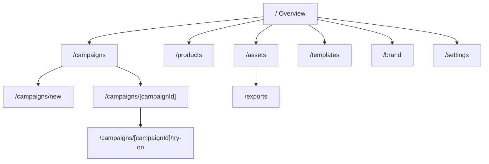

# Vanpella Campaign Studio Wireframes And Route Map

Date: March 21, 2026

## Route Map



## Information Architecture

### `/`

- Studio overview
- quick actions
- current campaign metrics
- route entry points

### `/campaigns`

- active campaign board
- filters
- status by stage
- links to create and detail views

### `/campaigns/new`

- guided setup
- product picker
- AI brief builder
- generation settings

### `/campaigns/[campaignId]`

- structured brief
- source products
- generated variants
- review and approval queue

### `/campaigns/[campaignId]/try-on`

- dedicated try-on workspace
- product + persona pairing
- uploaded face/model references
- recent try-on results

### `/products`

- feed-synced product browser
- retrieval fields
- localized content view
- reference imagery

### `/assets`

- generated media library
- resize/export states
- approval status

### `/exports`

- export-pack queue
- pack creation from approved assets
- preset-linked delivery configuration
- export status tracking
- bundle/file-name preview
- downloadable package generation

### `/templates`

- platform presets
- campaign objective presets
- reusable prompt packets
- editable delivery bundle defaults
- editable filename template rules

### `/brand`

- design tokens
- tone rules
- legal/promo guardrails

### `/settings`

- Convex link state
- Vercel link state
- Cloudflare/R2 setup state
- environment coverage

## Wireframe: Overview

```text
+--------------------------------------------------------------------------------------+
| Sidebar                     | Top summary / CTA bar                                  |
| - Overview                  | "Campaign Studio built for clean product storytelling" |
| - Campaigns                 | [New Campaign] [Open Product Feed]                     |
| - Products                  +--------------------------------------------------------+
| - Assets                    | Metrics: campaigns / products / draft assets / exports |
| - Templates                 +--------------------------------------------------------+
| - Brand                     | Left: primary flow                                    |
| - Settings                  | Right: platform preset preview                        |
|                             +--------------------------------------------------------+
|                             | Left: live route cards                                |
|                             | Right: create-surface snapshot                        |
+--------------------------------------------------------------------------------------+
```

## Wireframe: Create Campaign

```text
+--------------------------------------------------------------------------------------+
| Left column                              | Right column                               |
| Step 1 Campaign setup                    | Selected products                          |
| Step 2 Product context                   | Brand rules                                |
| Step 3 Brief builder                     | Pricing / offer context                    |
| Step 4 Generation                        | Platform preset summary                    |
|                                          +--------------------------------------------+
|                                          | Bottom composer for natural-language edits |
+--------------------------------------------------------------------------------------+
```

## Wireframe: Campaign Detail

```text
+--------------------------------------------------------------------------------------+
| Main column                              | Right rail                                 |
| Structured brief                         | Products in scope                          |
| Variant review grid                      | Approval queue                             |
| Notes / regeneration history             | Export actions                             |
+--------------------------------------------------------------------------------------+
```

## Why This Shape Works

- It keeps the UI close to the clean reference image you attached.
- It avoids a settings-heavy “AI tool” feel.
- It preserves a single dominant canvas for creative work.
- It maps directly to the Convex and R2-backed workflow in the technical plan.
